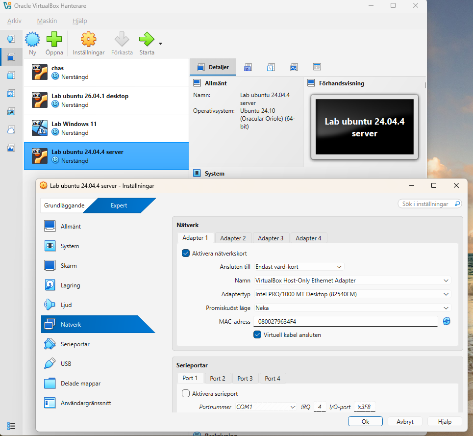

# Labbmiljö, Git, CLI och AI
Anders Schölin - 2026-09-15  
Kurs: Introduktion till yrkesrollen och grunderna i IT-infrastruktur (MYH 2025/4008)  

Uppgiften syftar till att demonstrera kunskap och praktiskta färdigheter i att sätta upp en virtuell labbmiljö, navigera CLI i Linux och Windows, dokumentera och spåra arbetet i Git samt att reflektera kritiskt kring AI-användning.

Dokumentationen är uppdelad i följande delar:
- **Labbmiljö och nätverk:** En beskrivning av uppsättningen och en översiktstabell
- **Kommandoradsgenomförande:** En beskrivning av genomförda kommandon i CLI
- **Git och Versionshantering:** Demonstration av ändringshistoriken i Git
- **AI-logg och Utvärdering:** Kritisk granskning av en AI-prompt med reslutat

## Labbmiljö och Nätverk

Labbmiljön är uppsatt i **Virtualbox**.   
En maskin kör Ubuntu Server 24.04 och en kör Windows 11 Pro.  
Båda maskinernas nätverksinställningar är satta till **Host-Only**  
för att isolera trafiken och möjliggöra intern kommunikation.  

### Översiktstabell
| Hostname | Operativsystem | IP-adress | Subnätmask | Standard Gateway |
| :--- | :--- | :--- | :--- | :--- |
| ubuntuserver | Ubuntu Server 24.04 | 192.168.1.50 | 255.255.255.0 | 192.168.1.1 |
| Lab-win | Windows 11 Pro | 192.168.1.51 | 255.255.255.0 | 192.168.1.1 |

## Kommandoradsgenomförande
*Steg-för-steg-dokumentation (med
CLI-kommandon och skärmdumpar/kodblock) för både Linux och Windows.*

## Git och Versionshantering

## AI-logg och Utvärdering
*Prompt, AI-utdata och din kritiska granskning.*

