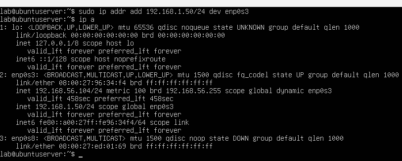
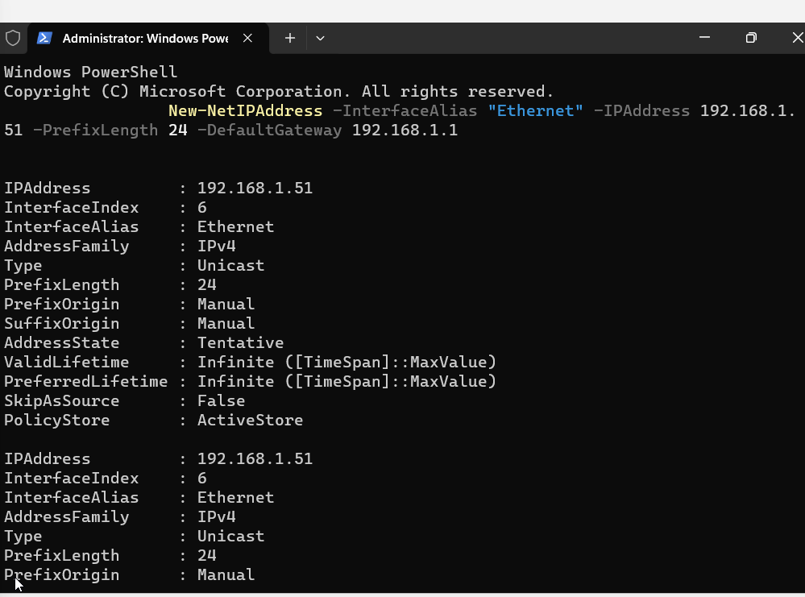
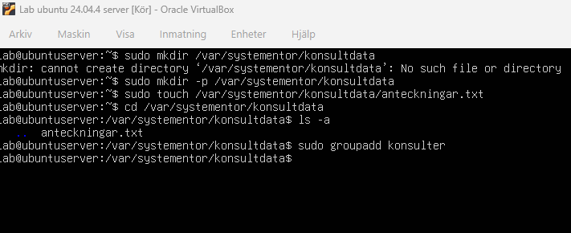
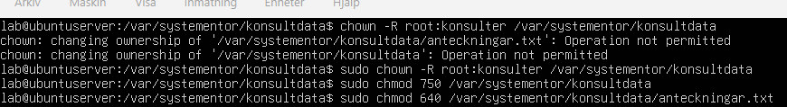
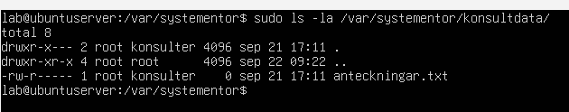
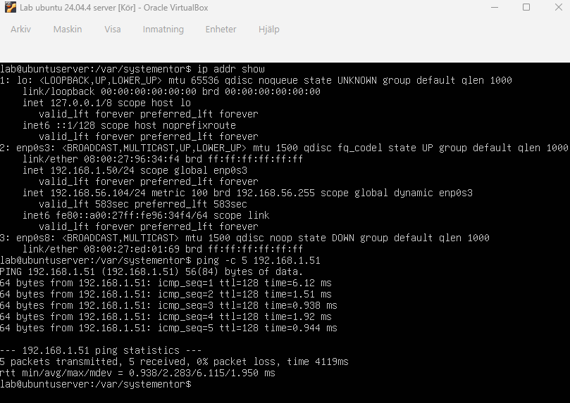
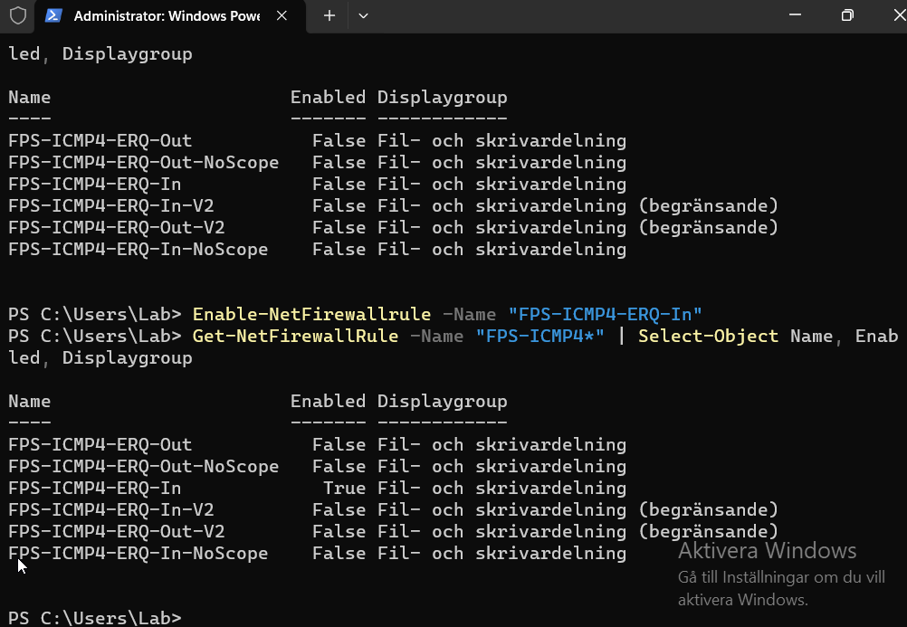
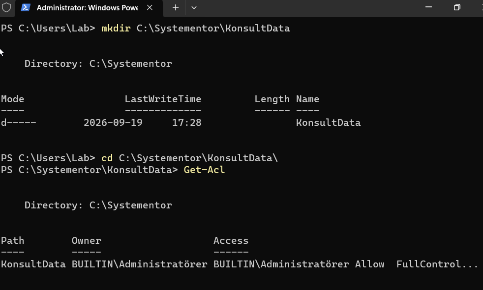
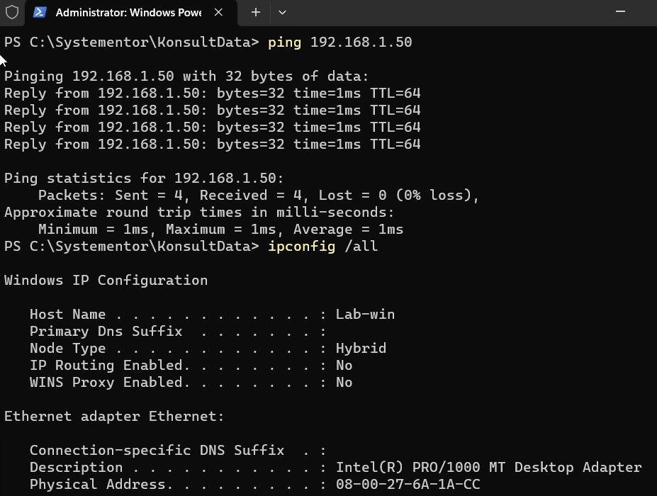
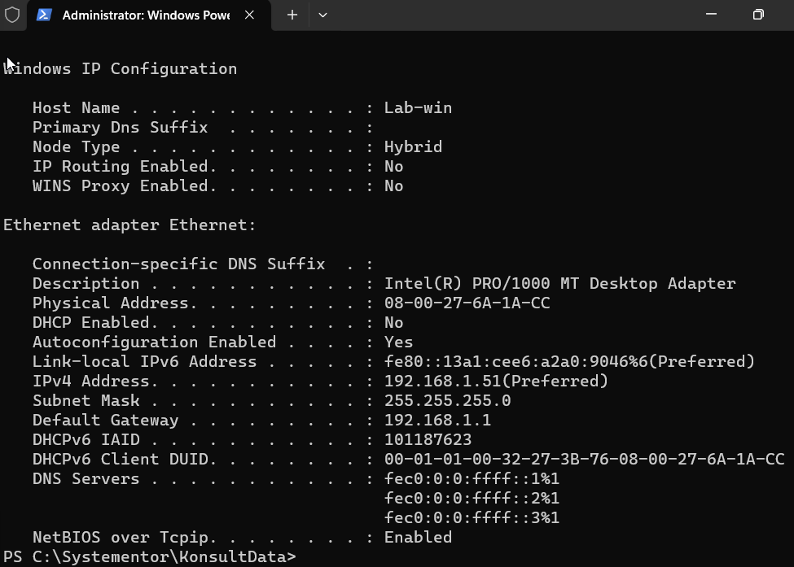

# Labbmiljö, Git, CLI och AI
Anders Schölin - 2026-09-15  
Kurs: Introduktion till yrkesrollen och grunderna i IT-infrastruktur (MYH 2025/4008)  

Uppgiften syftar till att demonstrera kunskap och praktiskta färdigheter i att sätta upp en virtuell labbmiljö, navigera CLI i Linux och Windows, dokumentera och spåra arbetet i Git samt att reflektera kritiskt kring AI-användning.

Dokumentationen är uppdelad i följande delar:
- **Labbmiljö och nätverk:** En beskrivning av uppsättningen och en översiktstabell
- **Kommandoradsgenomförande:** En beskrivning av genomförda kommandon i CLI
- **Git och Versionshantering:** Demonstration av ändringshistoriken i Git
- **AI-logg och Utvärdering:** Kritisk granskning av en AI-prompt med reslutat


## Labbmiljö och Nätverk

Labbmiljön är uppsatt i **Virtualbox**.   
En maskin kör Ubuntu Server 24.04 och en kör Windows 11 Pro.  
Båda maskinernas nätverksinställningar är satta till **Host-Only**  
för att isolera trafiken och möjliggöra intern kommunikation.  


### Översiktstabell
| Hostname | Operativsystem | IP-adress | Subnätmask | Standard Gateway |
| :--- | :--- | :--- | :--- | :--- |
| ubuntuserver | Ubuntu Server 24.04 | 192.168.1.50 | 255.255.255.0 | 192.168.1.1 |
| Lab-win | Windows 11 Pro | 192.168.1.51 | 255.255.255.0 | 192.168.1.1 |

### Konfiguration av maskinerna

På Linux-servern konstateras att nätverksenheten heter "enp0s3" med komanndot `ip a`  
IP adressen konfigureras sedan med kommandot:  
`sudo ip addr add 192.168.1.50/24 dev enop0s3`




För motsvarande i Windows behöver man först öppna Powershell som administratör, sedan sätts IP adressen med kommandot:  
```New-NetIPAddress -InterfaceAlias "Ethernet" -IPAddress 192.168.1.51 -PrefixLength 24 -DefaultGateway 192.168.1.1```




## Kommandoradsgenomförande
*Steg-för-steg-dokumentation (med
CLI-kommandon och skärmdumpar/kodblock) för både Linux och Windows.*

Här följer... 

### Linux, bash-kommandon

1. En arbetsmapp skapas med kommandot  
`sudo mkdir -p /var/systementor/konsultdata`  
Därefter skapas en tom fil i mappen med kommandot  
`sudo touch /var/systementor/konsultdata/anteckningar.txt`  

1. I bilden syns även kommandot `sudo groupadd konsulter` som används för att skapa en användargrupp med namnet konsulter.
1. Mappen konsultdata och allt i den ska tilldelas gruppen konsulter, för det används kommantot  
`sudo chown -R root:konsulter /var/systementor/konsultdata`  
och sedan ställs behörigheter för mappen och filen in med kommandot  
`sudo chmod 750 /var/systementor/konsultdata` och  
`sudo chmod 640 /var/systementor/konsultdata/anteckningar.txt`
  
1. Behörigheterna inspekteras därefter med kommandot  
`sudo ls -la /var/systementor/konsultdata/`  

1. Till sist verifieras nätverksanslutningen genom att pinga till Windows-VM:en
  
Det visade sig att Windows inbyggda brandvägg blockerade ping-anrop.  



### Windows, powershell-kommandon






## Git och Versionshantering


## AI-logg och Utvärdering
*Prompt, AI-utdata och din kritiska granskning.*

