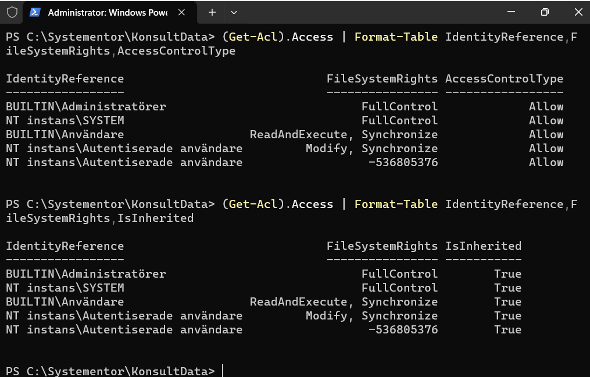
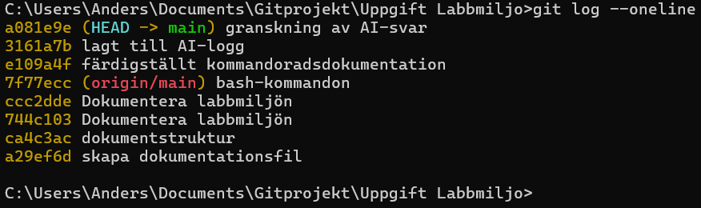

# Labbmiljö, Git, CLI och AI
Anders Schölin - 2026-09-15  
Kurs: Introduktion till yrkesrollen och grunderna i IT-infrastruktur (MYH 2025/4008)  

Uppgiften syftar till att demonstrera kunskap och praktiskta färdigheter i att sätta upp en virtuell labbmiljö, navigera CLI i Linux och Windows, dokumentera och spåra arbetet i Git samt att reflektera kritiskt kring AI-användning.

Dokumentationen är uppdelad i följande delar:
- **Labbmiljö och nätverk:** En beskrivning av uppsättningen och en översiktstabell
- **Kommandoradsgenomförande:** En beskrivning av genomförda kommandon i CLI
- **Git och Versionshantering:** Demonstration av ändringshistoriken i Git
- **AI-logg och Utvärdering:** Kritisk granskning av en AI-prompt med reslutat


## Labbmiljö och Nätverk

Labbmiljön är uppsatt i **Virtualbox**.   
En maskin kör Ubuntu Server 24.04 och en kör Windows 11 Pro (tredje och fjärde maskinen i bilden).  
Båda maskinernas nätverksinställningar är satta till **Host-Only** för att isolera trafiken och möjliggöra intern kommunikation. Maskinerna ska tilldelas IP-adresser enligt tabellen nedan.   


### Översiktstabell
| Hostname | Operativsystem | IP-adress | Subnätmask | Standard Gateway |
| :--- | :--- | :--- | :--- | :--- |
| ubuntuserver | Ubuntu Server 24.04 | 192.168.1.50 | 255.255.255.0 | 192.168.1.1 |
| Lab-win | Windows 11 Pro | 192.168.1.51 | 255.255.255.0 | 192.168.1.1 |

### Konfiguration av maskinerna

På Linux-servern konstateras att nätverksenheten heter "enp0s3" med kommandot,  
`ip a`  
IP-adressen konfigureras sedan med kommandot,  
`sudo ip addr add 192.168.1.50/24 dev enop0s3`


För motsvarande i Windows behöver man först öppna Powershell som administratör, sedan sätts IP adressen med kommandot:  
```New-NetIPAddress -InterfaceAlias "Ethernet" -IPAddress 192.168.1.51 -PrefixLength 24 -DefaultGateway 192.168.1.1```


## Kommandoradsgenomförande

Här följer steg-för-steg dokumentation över de moment som ingick i uppgiften. 

### Linux, bash-kommandon

1. En arbetsmapp skapas med kommandot mkdir,  
`sudo mkdir -p /var/systementor/konsultdata`  
Därefter skapas en tom fil i mappen med kommandot touch,  
`sudo touch /var/systementor/konsultdata/anteckningar.txt`  


1. I bilden syns även kommandot groupadd, som används för att skapa en användargrupp med namnet konsulter.  
`sudo groupadd konsulter`

1. Mappen konsultdata och allt i den ska tilldelas gruppen konsulter, för det används kommantot chown,  
`sudo chown -R root:konsulter /var/systementor/konsultdata`  
och sedan ställs behörigheter för mappen och filen in med kommandot chmod,  
`sudo chmod 750 /var/systementor/konsultdata` och  
`sudo chmod 640 /var/systementor/konsultdata/anteckningar.txt`


1. Behörigheterna inspekteras därefter med kommandot ls -la,  
`sudo ls -la /var/systementor/konsultdata/`  


1. Till sist verifieras nätverksanslutningen genom att skicka en ping till Windows-VM:en och undersöka nätverkskortets detaljer med kommandot ip sddr show,  
`ip addr show`och `ping -c 5 192.168.1.51`  
  


### Windows, powershell-kommandon

1. Först skapas mappen C:\Systementor\KonsultData med kommandot mkdir,  
`mkdir C:\Systementor\KonsultData`  


1. Behörighetsstrukturen ska inspekteras med kommandot Get-Acl.  
I bilden ovan syns att kommandot ger ett svar som slutar med "...", d.v.s. det finns mer att visa.  
Med ett utökat kommando kan man se att rättigheter har ärvts vid skapandet av mappen och att t.ex. alla användare har "ReadAndExecute" rättigheter.  
`(Get-Acl).Access | Format-Table IdentityReference,FileSystemRights,AccessControlType`  


1. Till sist verifieras nätverksanslutningen genom att skicka en ping till Linux-VM:en och undersöka nätverkskortets detaljer med kommandot ipconfig /all,  
  

### Felsökning

Det visade sig att Windows inbyggda brandvägg blockerade ping-anrop från Linux-maskinen. Frågar man AI om detta problem så föreslår den snabbt att man stänger av brandväggen (tillfälligt), men jag valde istället att öppna endast den regel som behövdes med kommandot,  
`Enable-NetFirewallrule -Name "FPS-ICMP4-ERQ-In"`  


## Git och Versionshantering

[Git-repository](https://github.com/anderssch-chas/Uppgift-Labbmiljo/blob/main/Labbdokumentation.md)




## AI-logg och Utvärdering

### Prompt och AI-utdata 

Prompt: ```Förklara hur man använder Get-Acl```

AI-utdata:
> Get-Acl är ett PowerShell-kommando som används för att läsa behörigheter (ACL – Access Control List) på filer, mappar och andra objekt i Windows.
Grundläggande användning
>
> Get-Acl "C:\Test\fil.txt"
> 
> Det visar bland annat vem som äger objektet och vilka åtkomstregler som finns.
>
>För en mapp:
>
>Get-Acl "C:\Test"
>
>Visa själva behörighetsreglerna
>
>Den viktigaste egenskapen är Access:
>
>(Get-Acl "C:\Test").Access
>
>Du får exempelvis information om:
>
>     IdentityReference – användaren eller gruppen
> 
>     FileSystemRights – vilka rättigheter de har
> 
>     AccessControlType – Allow eller Deny
> 
>     IsInherited – om regeln ärvs från en överordnad mapp
> 
>     InheritanceFlags – hur regeln ärvs
>   
> Ett typiskt resultat kan se ut ungefär så här:
>
> IdentityReference : CONTOSO\Users
FileSystemRights  : ReadAndExecute, Synchronize
AccessControlType : Allow
IsInherited       : True
> 
> Använda variabel
> 
> Det är ofta praktiskt att spara ACL:en i en variabel:
> 
> $acl = Get-Acl "C:\Test"
> 
> Sedan kan du exempelvis göra:
> 
> $acl.Owner
> 
> för att se ägaren, eller:
> 
> $acl.Access
> 
> för att se åtkomstreglerna.
Söka efter en viss användare
> 
> (Get-Acl "C:\Test").Access |
>     Where-Object { $_.IdentityReference -like "*Anna*" }
> 
> Viktigt: Get-Acl ändrar inget
> 
> Get-Acl är i första hand ett läs-kommando. Det hämtar den aktuella ACL:en men ändrar inte behörigheterna.
> 
> För att ändra behörigheter används exempelvis:
> 
> Set-Acl
> 
> Ett vanligt arbetsflöde är därför:
> 
> $acl = Get-Acl "C:\Test"
> 
> #undersök eller ändra $acl
> 
> Set-Acl "C:\Test" $acl
> 
> Om du vill kan jag också visa hur Get-Acl och Set-Acl används tillsammans för att ge en användare t.ex. Read, Modify eller Full Control, inklusive vad InheritanceFlags och PropagationFlags betyder.  

### Granskning av svaret

Jag brukar verifiera svaren genom att söka efter samma sak i officella manualer och guider, som "man *något kommando*" i Linux eller att söka på learn.microsoft.com i detta fall när det gäller powershell.  
En annan användbar metod är att be AI om källor på det svar den just gav. Ibland rättar den sig efter att ha granskat sin egen källa. I detta fallet var källan uteslutande learn.microsoft.com och vad jag kan se så är informationen korrekt.  
En fördel med en AI som beskriver kommandot är att det blir lättare att läsa förklaringen när den fylls ut med "vanlig språk", de officiella manualerna kan lätt bli väldigt tekniska och tunga att läsa.  
Jag försökte även några andra sökningar för att hitta ett exempel på hallucinationer, men troligen är grundläggande kommandoradskommandon för enkelt att hitta rätt svar på. 
